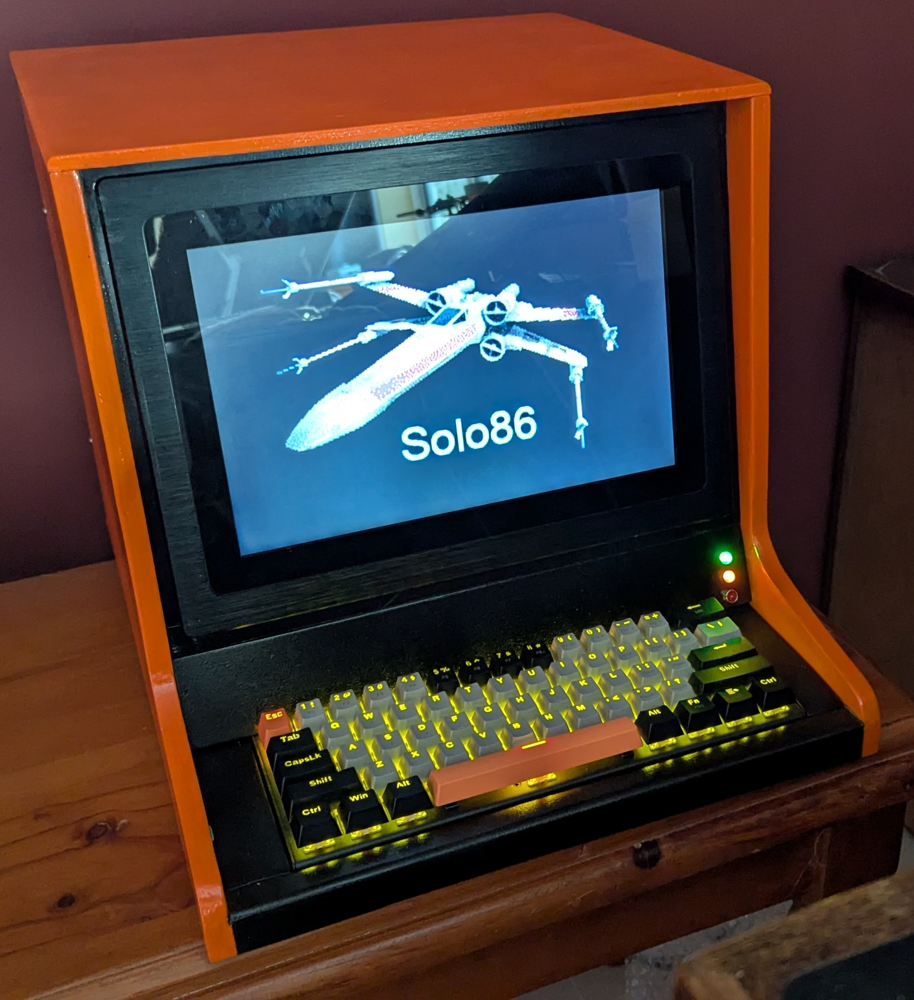

Welcome to Solo/86.

     _____       _          _______   ____
    /  ___|     | |        / /  _  | / ___|
    \ `--.  ___ | | ___   / / \ V / / /___
     `--. \/ _ \| |/ _ \ / /  / _ \ | ___ \
    /\__/ / (_) | | (_) / /  | |_| || \_/ |
    \____/ \___/|_|\___/_/   \_____/\_____/

This repository contains the tools and source code required to build the Solo/86 platform.

PLEASE NOTE: the work in this repository is on-going and should not be considered final.

# What is Solo/86?

An expandable computer built on the Intel IA16 architecture. The computer utilises an 80286 processor, 1MB RAM and 1MB of ROM. A central CPLD handles memory banking, interrupts and keeping the 80286 happy.

As we wanted a simple and clean architecture, the Solo/86 platform is not compatible with IBM XT and AT-style machines, although there are similarities.

At the hardware level we utilise through-hole components where possible, as this meets our personal __retro__ requirements.

# Getting Started

In order to get started with Solo/86, you'll need to build a system first. Please see [Hardware](/hardware/README.md) for more information about the mainboard and expansion cards. You won't necessarily need to build all of the expansion cards.

Once you have a system built, you can burn the ROMs and boot the system. Please see [Software](/software/README.md) for more information about the ROM. The default ROM contains the Solo/86 Monitor, some utilities and a copy of ELKS (ROM-based).

Solo/86 can be used directly with a display, keyboard and mouse, or through a telnet session over WiFi (text mode only).

# Who is behind Solo/86?

Dylan Hall and Ferry Hendrikx developed and built Solo/86 over some number of months. It is a homage to our 8-bit youth, when computers were simpler and every byte mattered.

