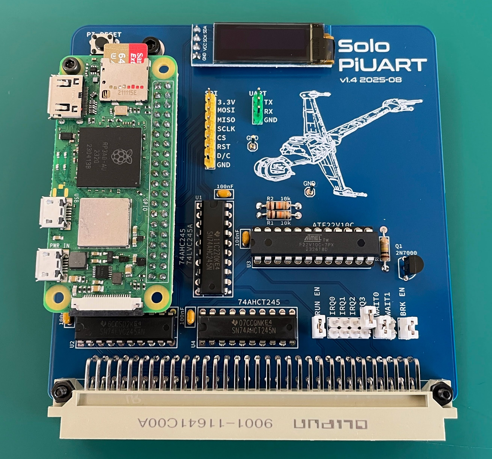

# Solo/86 UART

## Building

Install the components on the board in this order:

- Resistors R1, R2, R4, R5
- Capacitor 100uF x4
- Sockets
- Trans x2
- Headers
- Socket for PI

## Settings

- "BRK EN": if present, this allows the client to send a BREAK signal
  which causes the Solo/86 board to reset.

- "RUN EN": if present, the PI will reboot when the rest of the system
  reboots. This is not always desirable.

