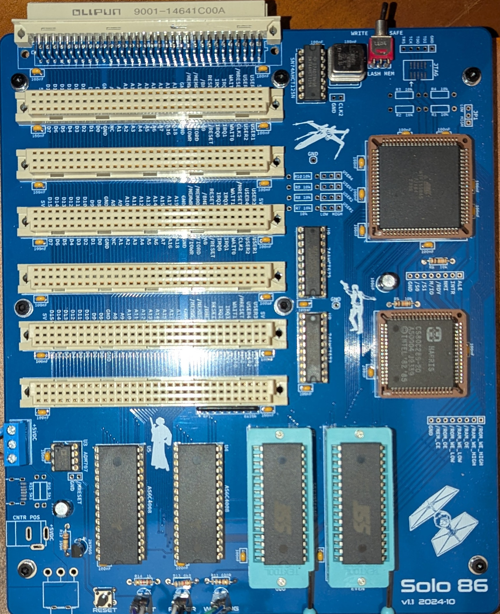
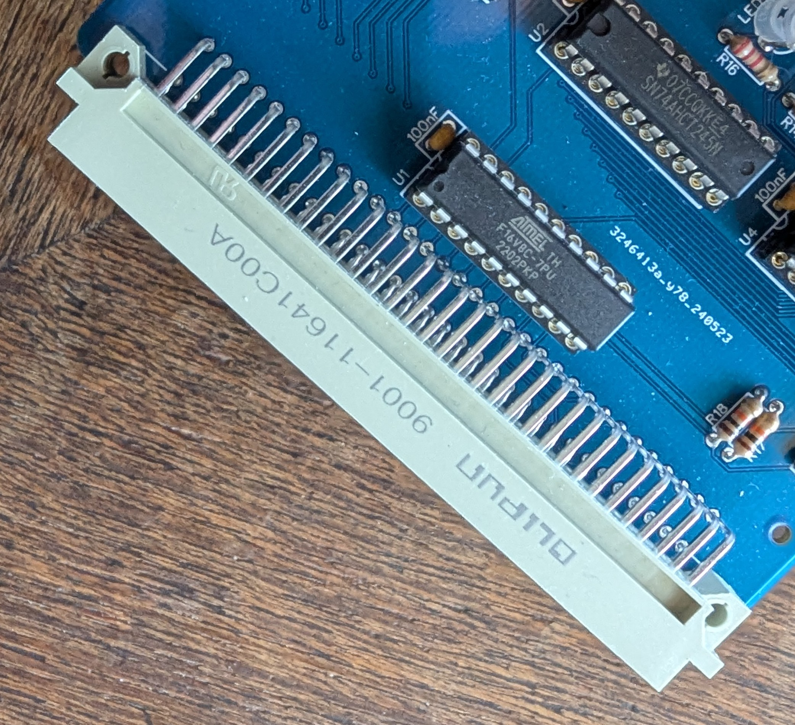
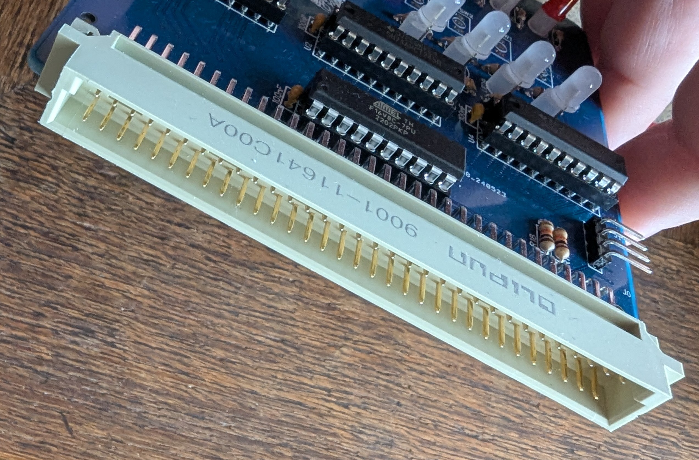

# Solo/86 Mainboard

## Building

Install the components on the board in this order:

- Capacitors x31
- Resistors R5 and R6
- Resistors R11, 13, 14
- Resistors R12
- Resistor Array RP1
- Transistor 2N7000
- LEDs
- Sockets U3, U4, U5, U8, U9, U10
- U1, U2
- Capacitor 100uF
- Power sockets
- Sockets U6 and U7

## Burning

TODO

## Power options

TODO

## Settings

TODO

## Card orientation

Each expansion card card should have a male slot soldered to it's front. When seated on the mainboard, all the cards should face the front of the mainboard (i.e. where the Solo86 words can be found). The only possible exception is the last slot on the mainboard, this may have a 90 degree angled male slot, allowing you to easily work on new or experimental expansion cards.

