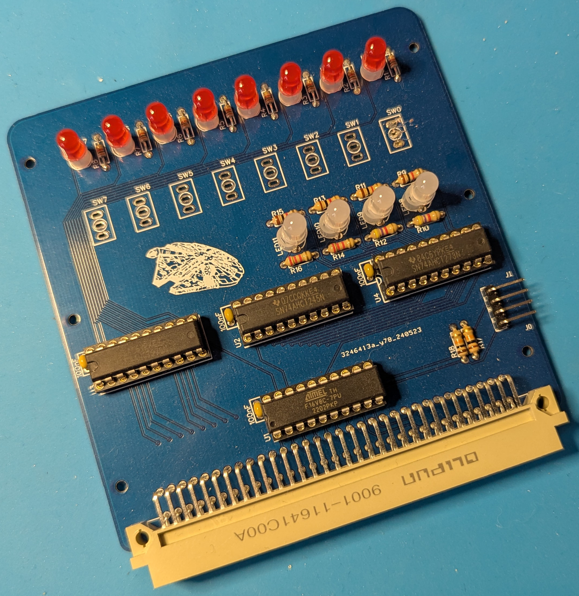

# Solo/86 Panel

The Solo/86 panel is a simple expansion card that provides feedback in the form of 8 LEDs. It also contains 8 switches that can be used to control the boot process. Both the LEDs and switches can be used by your own software in whatever way pleases you.

## Building

Please see the build instructions for the [Console](/hardware/console/README.md). These are essentially the same expansion card, but different physical expressions.

