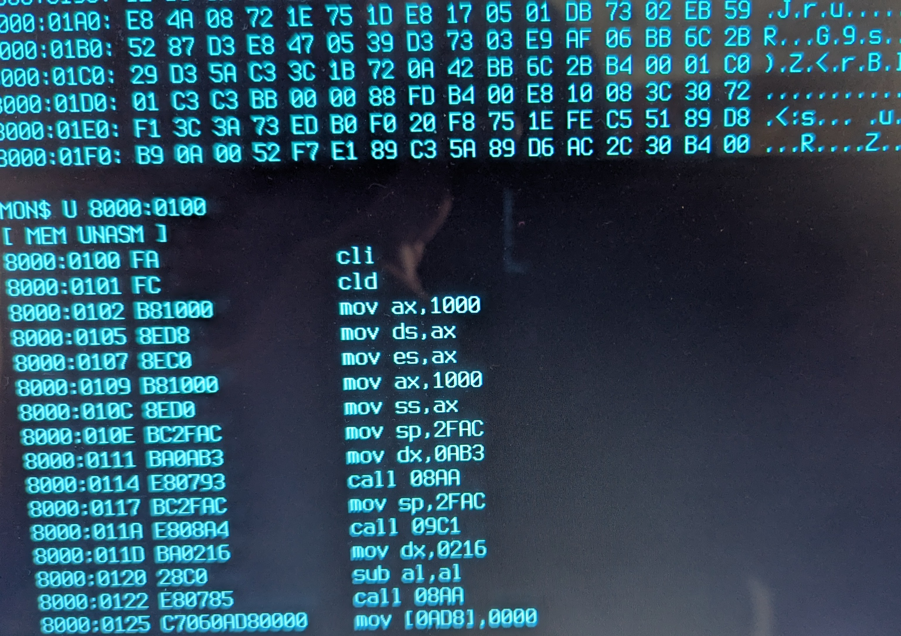

# Solo/86 Software and ROMs

This directory contains software and ROMs for the Solo/86 system.

## Introduction

The Solo/86 system assumes that it boots to the Solo/86 Monitor first. The monitor is responsible for initialising all of the hardware and providing debugging. The monitor can be used to load Intel Hex Files into RAM, dumping RAM/ROM and unassembling code.

## Building Solo/86

### What tools do I need to build Solo/86?

You'll need to install the following:
- make
- nasm
- perl

You'll also need to install the following to upload ROM images to a running monitor:
- nc

### Building

In the top-level directory, load the environment for building:

    source env.sh

Then build the system:

    make

The ROM binaries will be written to the rom/ directory.

Uploadable Intel Hex Files will be written to the hex/ directory. These can be uploaded directly to a running instance of the Monitor using the Load and Execute commands.

